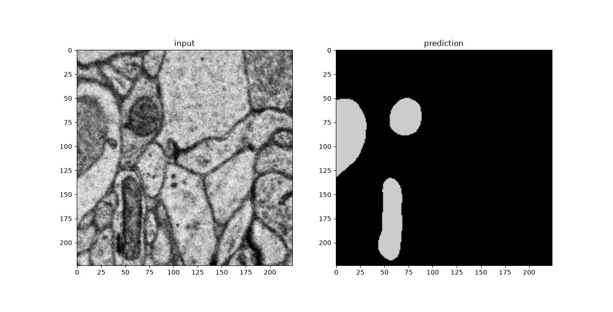

# omniem

`omniem` is a GUI-free Python package for electron microscopy (EM) image
workflows, built from the [EM-SSL project](https://github.com/pku-maleilab/EM-SSL-project). It gives you two main tools:

- **Run EM-DINO encoders** to extract CLS, patch, or inner-block features from
  EM images.
- **Run OmniEM models** for one-step segmentation or restoration.

The same public API is used by downstream tools, including the
[`omniem-train`](https://github.com/pku-maleilab/omniem-train) training pipeline
and the [napari-omniem](https://github.com/pku-maleilab/napari-omniem) GUI plugin.

## Contents

- [Install](#install)
- [Main Features](#main-features)
- [OmniEM Config YAML](#omniem-config-yaml)
- [First Commands](#first-commands)
- [Full Guides](#full-guides)
- [Related Projects](#related-projects)
- [Future Features](#future-features)
- [Citation](#citation)
- [License](#license)

## Install

`omniem` requires **Python >= 3.10**.

For inference and feature extraction, CUDA is recommended if you have a
supported NVIDIA GPU. Install the PyTorch build that matches your CUDA driver or
runtime first; use the selector in the
[PyTorch install guide](https://pytorch.org/get-started/locally/) for the exact
command for your machine.

Then install `omniem` from PyPI:

```bash
pip install omniem
```

Or clone the package repository and install it locally:

```bash
git clone https://github.com/pku-maleilab/omniem-package.git
cd omniem-package
pip install .
```

Core runtime dependencies include
[PyTorch](https://pytorch.org/), [NumPy](https://numpy.org/),
[tifffile](https://github.com/cgohlke/tifffile),
[Pydantic](https://docs.pydantic.dev/), [PyYAML](https://pyyaml.org/), and
[MONAI](https://monai.io/).

## Main Features

| Feature | Use it when | Main CLI | Main Python API |
|---|---|---|---|
| Encoder features | you only need EM-DINO backbone features, without an OmniEM head | `omniem features` | `EMEncoder.load(...)`, `enc.run(...)` |
| OmniEM inference | you have an OmniEM config plus OmniEM weights and want segmentation, restoration, or raw logits | `omniem infer` | `OmniEM.load(...)`, `omniem.run(...)` |

### Common Concepts

> **Encoder vs backbone.** "Encoder" is the EM-DINO network (the `EMEncoder`).
> "Backbone" refers to its weights — the `backbone_emdino_v1.pt` file and the
> `backbone=` / `--backbone` argument that pairs with a head's `head=`.

#### EMEncoder

Use an encoder when you only need the EM-DINO backbone output, without an
OmniEM head or config file. The encoder converts an EM image into feature
tensors that downstream code can reuse:

- `cls`: one global feature vector for the image;
- `patch`: a grid of local patch features;
- `inner`: optional intermediate block features.

For a 2D image, the encoder extracts features from that single XY tile. For a
3D volume, each XY slice is encoded with the same backbone, and the resulting
features are kept alongside the z-axis so downstream code can relate features
back to their original slices.

Available encoder models:

| Encoder arch | Description | Default norm | Input stride | Weights |
|---|---|---|---|---|
| `emdinov1` | EM-DINOv2 ViT-L/14, EM-domain pretrained encoder | mean `0.595446`, std `0.211906` in `[0, 1]` image space | 14 | [`backbone_emdino_v1.pt`](https://drive.google.com/drive/folders/1vpzVk6vDui8Aj34FdTMfJpXbt5wlMsx_?usp=drive_link) (bare `vit.*` checkpoint) |

#### OmniEM = EMEncoder + Head + Config + Weights

OmniEM builds on the encoder by adding a trained task head. Use an OmniEM model
(the `OmniEM` class) when you have a config YAML, weights, and a 2D or 3D EM
image. It computes raw logits internally; the config controls whether `omniem`
also applies a canonical output transform.

The OmniEM config YAML describes how to build the head and interpret its output:
OmniEM architecture, encoder architecture, 2D/3D shape, output channels,
`task_type`, and the fixed training `mean`/`std` in `[0, 1]` image space.

Weights are plain PyTorch `state_dict` files. They may be split into a shared
EM-DINO backbone file plus a head file, or stored as one merged whole file.
Split weights are useful when several heads share one encoder backbone. Merged
weights are easier when you want one standalone OmniEM file.

### Available OmniEM models

OmniEM model files are distributed outside the Python wheel. Download config YAML
files from [here](https://drive.google.com/drive/folders/1cFPBmozY5VAh8ZgSe16U7ydX9RMmvbzu?usp=drive_link). Download backbone and head weight files from [here](https://drive.google.com/drive/folders/1vpzVk6vDui8Aj34FdTMfJpXbt5wlMsx_?usp=drive_link).

| OmniEM | Purpose | Training on | Input | Weights | Config YAML |
|---|---|---|---|---|---|
| `mito-seg-ViT-L-2D` | mitochondria segmentation (2D) | MitoLab dataset | 2D EM tile | `backbone_emdino_v1.pt` + `head_mito-seg-ViT-L-2D.pt` | `model_mito-seg-ViT-L-2D.yaml` |
| `mito-seg-ViT-L-3D` | mitochondria segmentation (3D) | MitoEM-R | 3D subvolume (z >= 16) | `backbone_emdino_v1.pt` + `head_mito-seg-ViT-L-3D.pt` | `model_mito-seg-ViT-L-3D.yaml` |
| `denoise-emdiffuse-l` | image denoise | Low-level denoise EMDiffuse | 2D EM tile | `backbone_emdino_v1.pt` + `head_denoise-emdiffuse-l.pt` | `model_denoise-emdiffuse-l.yaml` |
| `superreso-emdiffuse-l` | image super-resolution | Low-level superresolution EMDiffuse | 2D EM tile | `backbone_emdino_v1.pt` + `head_superreso-emdiffuse-l.pt` | `model_superreso-emdiffuse-l.yaml` |

## OmniEM Config YAML

An OmniEM config tells `OmniEM` how to build the head and how to interpret
outputs.

```yaml
arch: omniemv1
encoder: emdinov1
img_z: 1
out_channels: 2
kernel3d_z: null
task_type: image2label
resize4emdino: false
mean: 0.5333333333333333
std: 0.23137254901960785
```

Field guide:

| Field | Meaning |
|---|---|
| `arch` | OmniEM architecture; see `omniem list-models` |
| `encoder` | encoder architecture; see `omniem list-encoders` |
| `img_z` | `1` for 2D heads; `>1` for 3D heads |
| `out_channels` | OmniEM output channels |
| `kernel3d_z` | z-kernel for 3D heads; usually `null` for 2D |
| `task_type` | `image2label`, `image2image`, or `null` |
| `resize4emdino` | whether the OmniEM uses resize-to-encoder-grid behavior |
| `mean`, `std` | fixed training normalization for this head |

`task_type` controls the canonical output transform:

| `task_type` | Meaning | Output transform |
|---|---|---|
| `image2label` | segmentation / labels | `argmax` over channels |
| `image2image` | restoration / denoise | `sigmoid`, clamp to `[0, 1]`, scale to uint |
| omitted / `null` | OmniEM has no output opinion | raw float logits only |

For a denoise/restoration head, `out_channels` is usually `1` and
`task_type: image2image`. For segmentation, `out_channels` is the number of
classes and `task_type: image2label`.

## First Commands

### Get the example inputs, configs, and weights

The commands below assume three local folders. They are not all included in the
pip wheel, so collect them once before running the examples:

| Folder | What it holds | How to get it |
|---|---|---|
| `examples/` | small example EM images (`.tif`) | tracked in the repo (see below) |
| `configs/` | OmniEM config YAMLs | Google Drive (see [Available OmniEM models](#available-omniem-models)) |
| `weights/` | backbone + head weight files | Google Drive (see [Available OmniEM models](#available-omniem-models)) |

**`examples/`** — if you installed with `git clone`, the example images are already
in `examples/`. If you installed from `pip`, download them into a local
`examples/` folder:

```bash
mkdir -p examples
BASE=https://raw.githubusercontent.com/pku-maleilab/omniem-package/main/examples
curl -L -o examples/2d_MitoEM_H_0_0_0.tif       "$BASE/2d_MitoEM_H_0_0_0.tif"
curl -L -o examples/3d_AxonEM-H-0-0-0_0_0_0.tif "$BASE/3d_AxonEM-H-0-0-0_0_0_0.tif"
curl -L -o "examples/gly-z=0.tif"               "$BASE/gly-z=0.tif"
```

**`configs/` and `weights/`** — these are distributed outside the wheel. Download
the OmniEM config YAMLs and the backbone/head weight files from the Google Drive
links in [Available OmniEM models](#available-omniem-models), then place them in
local `configs/` and `weights/` folders so the paths below resolve:

```text
configs/   model_*.yaml         (config YAMLs)
weights/   backbone_emdino_v1.pt, head_*.pt   (weight files)
```

Run the commands from the directory that contains the `examples/`, `configs/`,
and `weights/` folders.

### Extract encoder features

Use the encoder when you only need EM-DINO backbone features — no OmniEM config or
head. Extract features from the CLI with `omniem features`; `--want` picks any of
`cls,patch,inner`; `inner` needs `--blocks`):

```bash
omniem features \
  -i examples/2d_MitoEM_H_0_0_0.tif \
  --arch emdinov1 \
  --weights weights/backbone_emdino_v1.pt \
  --want cls,patch \
  -o out/mito_features.npz
```

Run the same encoder from Python:

```python
import numpy as np
import tifffile
import torch
from omniem import EMEncoder

enc = EMEncoder.load("emdinov1", "weights/backbone_emdino_v1.pt")

img = tifffile.imread("examples/2d_MitoEM_H_0_0_0.tif")
x = torch.from_numpy(img.astype(np.float32) / 255.0)   # raw float, channel-less
feats = enc.run(x, axes="yx", return_cls=True, return_patch=True)
cls = feats["cls"]        # [B, Z, D]  — one global vector per slice (here [1, 1, D])
patch = feats["patch"]    # [B, Z, N, D] — the grid of patch features
# Intermediate block features: enc.run(x, axes="yx", return_blocks=[5, 11])["inner"]
```

`enc.run` returns features shaped `[B, Z, ...]` (a 2D tile is `B=Z=1`); pass
`squeeze="bz"` to drop singleton batch / z axes. The encoder is channel-less and
never applies an OmniEM head — for the power path, build a canonical `[b, z, y, x]`
tensor and call `enc.forward(canonical)`.

### Run OmniEM

Run OmniEM inference from the CLI:

```bash
omniem infer \
  -i examples/2d_MitoEM_H_0_0_0.tif \
  -m configs/model_mito-seg-ViT-L-2D.yaml \
  --backbone weights/backbone_emdino_v1.pt \
  --head weights/head_mito-seg-ViT-L-2D.pt \
  -o out/mito_labels.tif
```

Run the same OmniEM from Python:

```python
import numpy as np
import tifffile
import torch
from omniem import OmniEM

omniem = OmniEM.load(
    "configs/model_mito-seg-ViT-L-2D.yaml",
    backbone="weights/backbone_emdino_v1.pt",
    head="weights/head_mito-seg-ViT-L-2D.pt",
)

img = tifffile.imread("examples/2d_MitoEM_H_0_0_0.tif")
x = torch.from_numpy(img.astype(np.float32) / 255.0)   # raw float, channel-less
labels = omniem.run(x, axes="yx", dtype="uint8")       # task output at the input XY
# Caller-layout float logits instead of the task transform:
# logits = omniem.run(x, axes="yx", return_logits=True)
```

`omniem.run` takes a raw image plus `axes` (characters from `{b, z, y, x}` — no
channel axis) and returns the output at the input's original XY size. For advanced
use, build a canonical `[b, z, y, x]` tensor and call `omniem.predict(canonical)`.

Below is an example to check the prediction, plotting the input and the output
side by side with `matplotlib`. It is **not** an `omniem` dependency, so install
it as:

```bash
pip install matplotlib
```

Continuing from the variables above (`img` and `labels`):

```python
import matplotlib.pyplot as plt

fig, (ax_in, ax_out) = plt.subplots(1, 2, figsize=(8, 4))
ax_in.imshow(img, cmap="gray")
ax_in.set_title("input")
ax_out.imshow(labels, cmap="nipy_spectral")   # the mito-seg label map
ax_out.set_title("prediction")
for ax in (ax_in, ax_out):
    ax.axis("off")
plt.tight_layout()
plt.show()                      # or plt.savefig("mito_overlay.png")
```



### Output-size control (super-resolution)

OmniEM is shape-preserving (output XY == input XY). To get a larger
output, for example for super-resolution, resize the input up first with
`--output-scale F`; OmniEM then returns its output at the scaled size
(`F > 1` upscales, `F < 1` is a quick-inference speed trade-off). It is XY-only
(Z is never resized; 3D volumes warn) and orthogonal to `--conform`:

```bash
omniem infer \
  -i examples/2d_MitoEM_H_0_0_0.tif \
  -m configs/model_superreso-emdiffuse-l.yaml \
  --backbone weights/backbone_emdino_v1.pt \
  --head weights/head_superreso-emdiffuse-l.pt \
  --output-scale 1.5 \
  -o out/mito_1.5x.tif
```

### Split or merge weight files

Convert between one merged `.pt` file and a `backbone` + `head` pair. The split
point is the net's derived encoder prefix, so it stays correct for any encoder.

```bash
# merged -> split pair
omniem split -m configs/model_mito-seg-ViT-L-2D.yaml \
  -i weights/merged_mito-seg.pt \
  --backbone weights/backbone_emdino_v1.pt --head weights/head_mito-seg-ViT-L-2D.pt

# split pair -> merged
omniem merge -m configs/model_mito-seg-ViT-L-2D.yaml \
  --backbone weights/backbone_emdino_v1.pt --head weights/head_mito-seg-ViT-L-2D.pt \
  -o weights/merged_mito-seg.pt
```

## Full Guides

- [CLI guide](docs/cli.md): all `omniem features`, `omniem infer`, `omniem split`,
  and `omniem merge` options, with command examples.
- [Python API guide](docs/api.md): `EMEncoder`, `OmniEM`, shared encoders,
  lower-level calls, weight saving, errors, and API-doc generation.

## Related Projects

- [omniem-train](https://github.com/pku-maleilab/omniem-train): the recommended
  training pipeline for OmniEM heads; it builds on this package's public API.
- [napari-omniem](https://github.com/pku-maleilab/napari-omniem): a napari GUI
  plugin for interactive OmniEM inference.

## Future Features

The current package focuses on the core encoder/OmniEM surface. These features are
planned for later releases:

- large-image tiling and blending (`Inferer`);
- volume streaming and hdf5/zarr/n5 IO;
- feature-export orchestration (`Exporter`);
- install extras such as `[infer]`, `[volume]`, and `[full]`.

## Citation

**Under review**

```
Unifying the Electron Microscopy Multiverse through a Large-scale Foundation Model.
Liuyuan He, Ruohua Shi, Wenyao Wang, Guanchen Fang, Yu Cai, Lei Ma*.
```

## License

[MIT](LICENSE).
